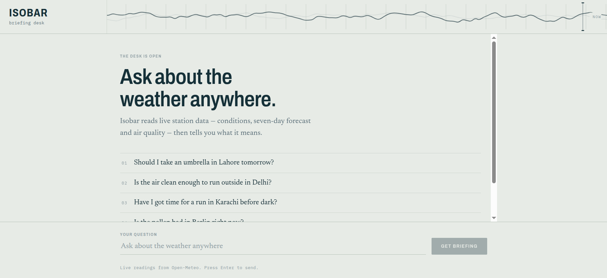
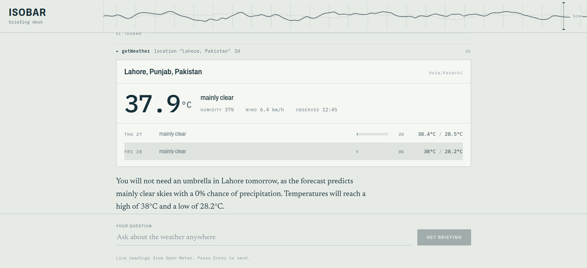
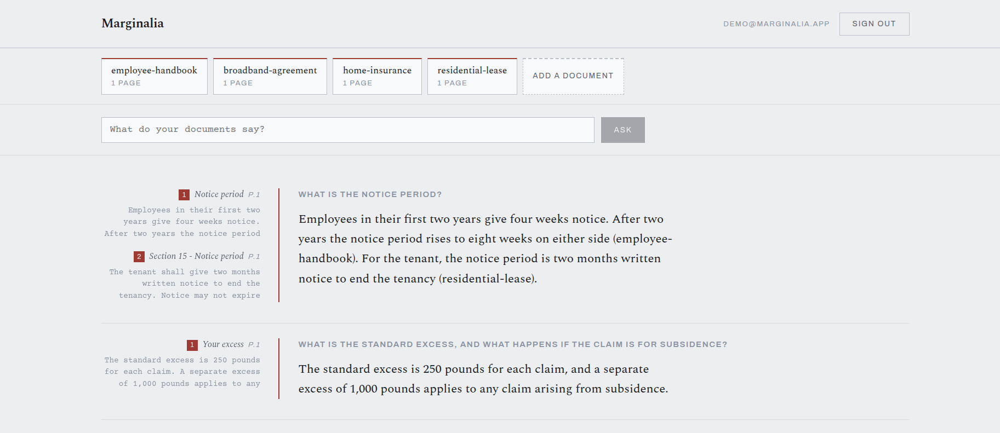
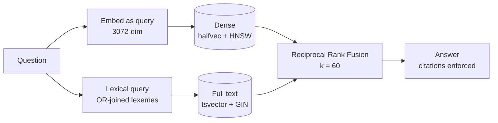
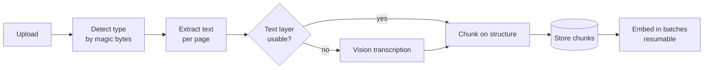

# Isobar & Marginalia

Two AI applications sharing one deployment.

**Isobar** is a weather agent. It calls live meteorological APIs and explains what the readings mean, rather than reciting them.

**Marginalia** is a retrieval-augmented question answering system for your own documents. Every answer cites the page it came from, or says plainly that your documents do not cover the question. It refuses more readily than it guesses.

Both run as a single Next.js application on AWS Lambda.

---

## Live

| App | Link | What it does |
| --- | --- | --- |
| **Isobar** | https://fvifdjl2l2o67kob5yaack36lu0rlxuo.lambda-url.us-east-1.on.aws/ | Ask about the weather anywhere |
| **Marginalia** | https://fvifdjl2l2o67kob5yaack36lu0rlxuo.lambda-url.us-east-1.on.aws/marginalia | Ask questions of your own documents |

### Demo account

Marginalia keeps each person's documents private, so it needs a sign-in. Use:

```
email     demo@marginalia.app
password  MarginaliaDemo-2026
```

It is preloaded with four short synthetic contracts — a lease, an insurance policy, a broadband agreement and an employee handbook. Four questions worth trying, each verified against the live deployment:

| Ask | Why it is interesting |
| --- | --- |
| *What is the standard excess, and what happens if the claim is for subsidence?* | A figure lookup with a caveat attached — both numbers have to survive |
| *What are the rules about keeping animals?* | The lease says "assistance dogs" and never "animals". Retrieval has to bridge the paraphrase |
| *What is the notice period?* | Two documents define one. The answer gives both and attributes each to its own contract |
| *What is the excess on my broadband contract?* | An excess exists, and a broadband contract exists — but not together. It refuses |

That last one is the point of the whole system. Refusing is easy when nothing matches; refusing when the pieces of a plausible answer are all present in different documents is the hard case.

This is a shared account and its data is disposable. Anything uploaded there is visible to anyone else using the demo.

---

## Isobar



Ask a question in plain language. Isobar decides which instruments to read, calls them, and writes the briefing.



Four tools, all backed by [Open-Meteo](https://open-meteo.com): current conditions and forecast, air quality, sun and UV, and pollen. The model chooses which to call and how to combine them — the screenshot above shows it reaching for `getWeather` with `"Lahore, Pakistan"` and asking for two days, because the question was about tomorrow.

Replies stream token by token. A run is capped at 8 tool-calling steps and a 50-second budget, so a confused model cannot loop indefinitely on someone else's quota.

---

## Marginalia



Upload PDFs, ask questions, get answers that point at their source. The citation in the margin carries the heading path it was found under and the page number it appeared on, so an answer can be checked without re-reading the document.

The screenshot above is one question spanning two contracts. Both define a notice period, and the answer gives each figure separately, attributed to the document it came from. Under the surface the model emits an opaque chunk id as its citation marker, which the client resolves to a document name — so attribution is machine-checkable rather than a phrase the model chose to write.

The design commitment is narrow and deliberate: **an answer is grounded in retrieved text or it is not given.** Citations are validated against the retrieved set before the response is returned, so a model that invents a source produces an error rather than a plausible lie. When retrieval finds nothing, the model is never called at all — there is nothing for it to be tempted by.

### How retrieval works



Two retrieval arms, because they fail differently. Dense embeddings handle paraphrase — *"animals"* finding a clause that only says *"assistance dogs"* — but drift on rare exact tokens. Full-text search nails exact tokens and proper nouns but is blind to paraphrase. Each arm returns 50 candidates, and [Reciprocal Rank Fusion](https://plg.uwaterloo.ca/~gvcormac/cormacksigir09-rrf.pdf) merges them into 20 by rank rather than score, which avoids having to make two incomparable scoring scales agree.

Both arms and the fusion run in a single SQL statement, so retrieval is one round trip.

### Ingestion



Text first, vision only where needed. Each page is assessed on its own — a scanned appendix inside an otherwise digital PDF gets transcribed while the rest does not, so nobody pays for vision on a document that never needed it.

Chunking follows document structure rather than a character count. Headings become breadcrumbs carried into the embedding, tables keep their header row when split, code fences stay intact, and overlap never crosses a heading boundary — because text either side of a heading is about different things, and stitching them together manufactures a passage that says something neither section said.

---

## Measured, not asserted

Retrieval quality is a claim, so it needs evidence. A golden set of 16 questions over a four-document corpus runs with `npm run eval`.

| metric | value |
| --- | --- |
| retrieval questions | 13 |
| mean recall@5 | 1.000 |
| mean reciprocal rank | 0.801 |
| mean nDCG@5 | 0.851 |
| answered and grounded | 13/13 |
| refusals correct | 3/3 |

The questions are chosen to be hard in specific ways: paraphrase, exact-token lookup, figures, conditionals, and *confusable* pairs where two documents both plausibly answer and only one is right. Three questions have no answer in the corpus at all and exist purely to check that the system refuses.

### Reranking is implemented, measured, and turned off

A listwise Gemini reranker reorders fused candidates before answering. Enabled, it improves the numbers:

| | recall@5 | MRR | nDCG@5 |
| --- | --- | --- | --- |
| fused only | 1.000 | 0.801 | 0.851 |
| with reranking | 1.000 | **0.904** | **0.928** |

It ships disabled anyway. The entire +0.103 MRR comes from two of thirteen questions moving from rank 3 to rank 1. Thirteen questions over seventeen chunks is a small sample, and a single flip either way moves the mean by 0.05. The direction is right and the mechanism is understood, but that is not yet evidence that would survive a larger corpus — and it costs an extra model call on every question. Turn it on with `RERANK=1` and judge for yourself.

Full detail, including which questions moved: [`src/rag/eval/BASELINE.md`](src/rag/eval/BASELINE.md).

---

## Engineering notes

A few decisions where the obvious approach was wrong.

**`halfvec`, not `vector`.** Gemini's embeddings are 3072-dimensional. pgvector can only build an HNSW index on a `vector` column up to 2000 dimensions — but `halfvec` indexes up to 4096. Storing half-precision costs a little recall and buys an index that turns a sequential scan into a graph traversal. The alternative was truncating the embedding, which costs more.

**The lexical arm was silently dead.** `websearch_to_tsquery` joins terms with AND. A natural-language question like *"what happens if my broadband is down for a week?"* therefore required every one of those words to appear in a chunk, so it matched nothing — and because fusion still returned the dense results, the bug looked exactly like working software. Retrieval now builds an OR-joined lexeme query. Only the eval harness caught this: every unit test still passed.

**The database refuses service-role keys.** `readSupabaseConfig` rejects `sb_secret_` and `service_role` keys outright, so a key that bypasses row-level security cannot be loaded by the app even by accident. Isolation is enforced in Postgres by RLS keyed on `auth.uid()`, not in application code — the `anon` role holds no grant on the `rag` schema at all.

**Unembedded chunks are the queue.** Embedding a 40-page document cannot finish inside one request. Rather than a job table, chunks are stored first and their vectors filled in afterwards; a chunk without a vector *is* the outstanding work. Ingestion resumes from any device holding the owner's token, and a crash mid-embedding costs nothing but the batch in flight.

**A Function URL, not API Gateway.** API Gateway caps integration at 29 seconds. Parsing a 40-page PDF measures around 9 seconds, answering 10–20, and Isobar's own budget is 50 — so the gateway would have timed out on the paths that matter. Function URLs also stream natively, which Isobar needs.

---

## Running it locally

Requires Node 22+, a [Google AI Studio](https://aistudio.google.com/apikey) key, and a Supabase project.

```bash
git clone https://github.com/asimrazadev10/ToolCalls.git
cd ToolCalls
npm install
cp .env.example .env      # then fill in the three values
npm run dev
```

Isobar is at `/` and needs only the Gemini key. Marginalia is at `/marginalia` and additionally needs Supabase — apply `supabase/migrations/*.sql` in order, which create the `rag` schema, its RLS policies, the hybrid search function, and the rate limiter.

The default model is `gemini-3.5-flash-lite`, chosen because the free tier allows 15 requests/minute against 5 for the flash models and none for Pro.

## Tests

```bash
npm run verify    # typecheck, lint, and 215 tests across 20 files
npm test          # tests alone
npm run eval      # retrieval quality against the golden set (costs quota)
```

Everything was built test-first. The tests are written to fail for the right reason before any implementation exists, and several assert what must be *absent* — a chunker test that only checks the right text is present will happily pass while the chunker silently duplicates it, which is precisely the bug that once shipped.

`npm run eval` needs a signed-in user and real quota, so it is a script rather than a test. Set `EVAL_EMAIL` and `EVAL_PASSWORD` to an account that owns the corpus.

## Deploying

```bash
./scripts/deploy.sh
```

Verifies, builds a `linux/amd64` image tagged by commit, pushes to ECR, deploys the CloudFormation stack in [`infra/`](infra/marginalia-stack.yaml), forces the function to pull the new digest, and smoke-tests the live URL — failing the deploy if an unauthenticated request is *not* refused.

Then it deletes the AWS access key it used and removes `~/.aws/credentials`. Revocation is a trap registered before any work starts, so a failed build or an interrupt still ends with the key gone. Set `KEEP_KEY=1` to retry a failed deploy without minting a new one.

The stack is one Lambda function (2048 MB, 120 s timeout) behind a Function URL in `RESPONSE_STREAM` mode, plus a log group with 7-day retention. The container uses the AWS Lambda Web Adapter, so the same image runs unchanged under `docker run`.

## Repository map

```
src/
  app/                 routes and UI for both applications
  lib/ai/              Isobar: agent, tools, rate limiting
  rag/
    ingest/            type detection, extraction, chunking, headings
    embed/             embedding input, Gemini client, vector encoding
    retrieve/          fusion, reranking, reordering
    answer/            grounded answering with enforced citations
    db/                Supabase access, repository, rate limiting
    eval/              golden set, metrics, recorded baseline
supabase/migrations/   schema, RLS, hybrid search, rate limiter
infra/                 CloudFormation stack
scripts/               deploy, evaluation, fixture generation
```

## Stack

Next.js 15 · React 19 · TypeScript · [AI SDK v5](https://ai-sdk.dev) · Gemini · Supabase (Postgres 17 + pgvector) · Vitest · AWS Lambda
